# Module 0 - 사전 준비

!!! warning "사전 점검 권장"
    Anthropic Claude는 최초 사용 시 **사용 사례 양식(website URL 필요)** 제출이 필요합니다. 제출하면 즉시 부여되지만, 신규 계정의 결제 수단 검증이나 콘솔 반영 지연(수 분) 같은 변수가 있으니 **핸즈온 하루 전쯤 미리** 확인해 두세요.

## 0-1. AWS 계정 준비

AWS 계정이 없는 경우 [https://aws.amazon.com](https://aws.amazon.com) 에서 생성합니다.

!!! warning "프리 티어로는 부족합니다"
    신규/기존 계정 모두 사용할 수 있지만, 이 핸즈온에서 쓰는 **OpenSearch Serverless, AWS DataSync, Amazon Bedrock은 프리 티어로 커버되지 않아 소액의 비용이 발생**합니다. 특히 OpenSearch Serverless는 시간당 과금되므로(약 $0.48/시간), 결제 수단(신용카드) 등록이 필요하며 핸즈온이 끝나면 반드시 [Module 4 — 리소스 정리](04-cleanup.md)를 진행하세요.

!!! danger "필수 확인"
    이 핸즈온은 **IAM 사용자**로 로그인해야 합니다. **루트 사용자(Root user)로는 Bedrock Knowledge Base를 생성할 수 없습니다.**
    IAM 사용자가 없는 경우 아래 절차로 생성하세요.

!!! tip "이미 IAM 사용자가 있다면 건너뛰세요"
    **`AdministratorAccess` 권한을 가진 IAM 사용자가 이미 있다면**, 아래 "IAM 사용자 생성" 단계는 **생략**하고
    그 사용자로 로그인한 뒤 아래 **0-3 리전 설정**부터 진행하면 됩니다.
    (Admin 권한이 없는 IAM 사용자라면, 0-5의 서비스 권한을 갖췄는지 확인하세요.)

### IAM 사용자 생성 (루트 사용자인 경우)

1. AWS 콘솔에서 **[IAM](https://us-east-1.console.aws.amazon.com/iam/home?region=ap-northeast-2#/home)** 서비스로 이동합니다
2. 좌측 메뉴에서 **IAM 사용자** → **사용자 생성** 클릭

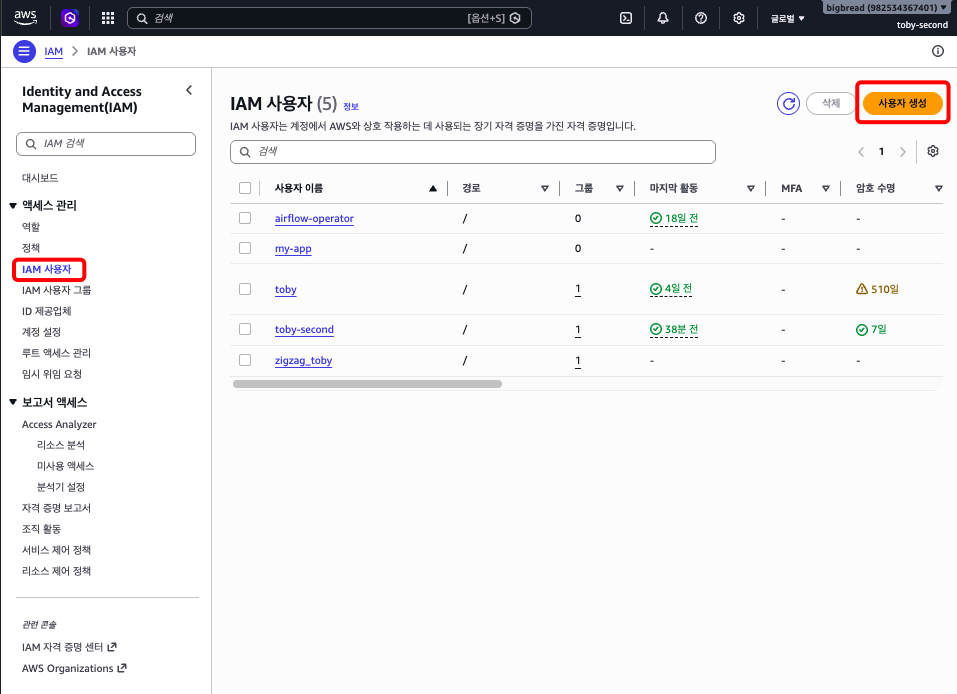
3. 다음과 같이 설정해 주세요:

| 항목 | 값 |
|------|-----|
| User name | `scd26-admin` (또는 원하는 이름) |
| Console access | **AWS Management Console에 대한 사용자 액세스 권한 제공 – 선택 사항** 체크 |
| Password | 콘솔 암호 > 사용자 지정 암호 |

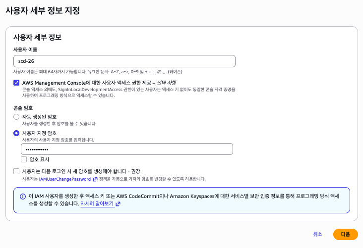

4. **권한 설정** 단계에서 **직접 정책 연결** → `AdministratorAccess` 선택

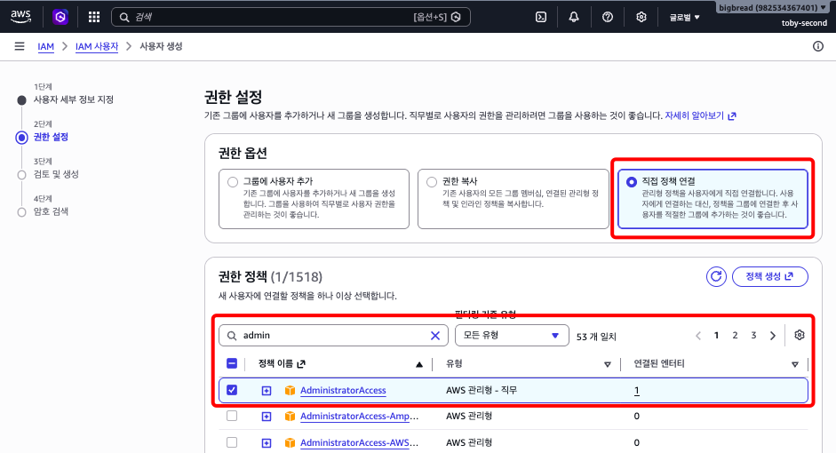

5. **다음 > Create user** 클릭

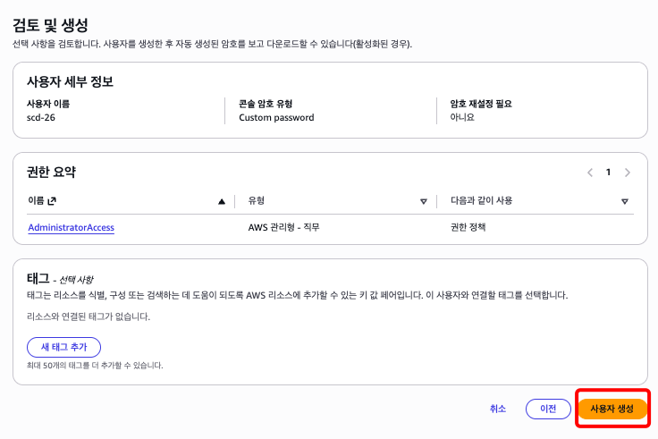

6. 생성 완료 후, **루트 사용자에서 로그아웃**하고 **IAM 사용자로 다시 로그인**합니다

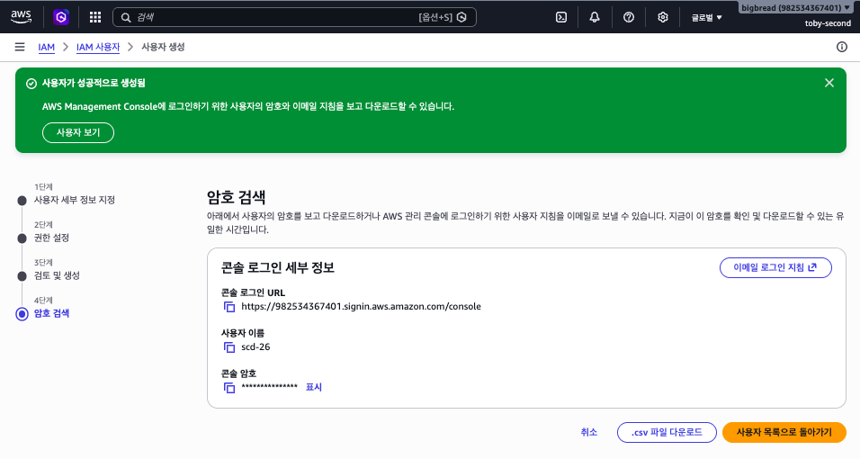

> 로그인 URL 형식: `https://{계정ID}.signin.aws.amazon.com/console`

## 0-2. AWS CLI 설치 및 자격증명 등록 (선택)

!!! tip "이 섹션은 건너뛰어도 됩니다"
    이번 핸즈온은 기본적으로 **AWS 콘솔 클릭**으로 진행합니다. CLI 스크립트는 콘솔 단계를 놓쳤거나
    잘못 설정했을 때 **되돌려서 한 번에 재구축하는 폴백/복구용**입니다.

    - **콘솔만 사용**하거나 **AWS CloudShell**에서 스크립트를 실행할 경우 → **0-2는 생략**하세요.
      (CloudShell에는 AWS CLI v2가 이미 설치돼 있고, 콘솔 로그인 자격증명이 자동 적용됩니다.)
    - **내 PC(로컬)에서 직접 CLI 스크립트를 실행**할 때만 아래 설치·자격증명 등록이 필요합니다.

핸즈온 스크립트를 **로컬에서** 사용하려면 AWS CLI가 설치되어 있고, IAM 사용자의 자격증명이 등록되어야 합니다.

### AWS CLI v2 설치

| OS | 설치 명령 |
|----|-----------|
| macOS (Homebrew) | `brew install awscli` |
| macOS (공식 설치 파일) | [AWS CLI macOS 설치 가이드](https://docs.aws.amazon.com/cli/latest/userguide/getting-started-install.html) |
| Windows | [AWS CLI MSI 설치 파일 다운로드](https://awscli.amazonaws.com/AWSCLIV2.msi) |
| Linux | `curl "https://awscli.amazonaws.com/awscli-exe-linux-x86_64.zip" -o "awscliv2.zip" && unzip awscliv2.zip && sudo ./aws/install` |

설치 확인:
```bash
aws --version
# aws-cli/2.x.x Python/3.x.x ...
```

### IAM 사용자 Access Key 생성

1. AWS 콘솔에서 **IAM** → **Users** → 위에서 만든 사용자 클릭 (scd-26)
2. **Security credentials** 탭 → **Access keys** → **Create access key**

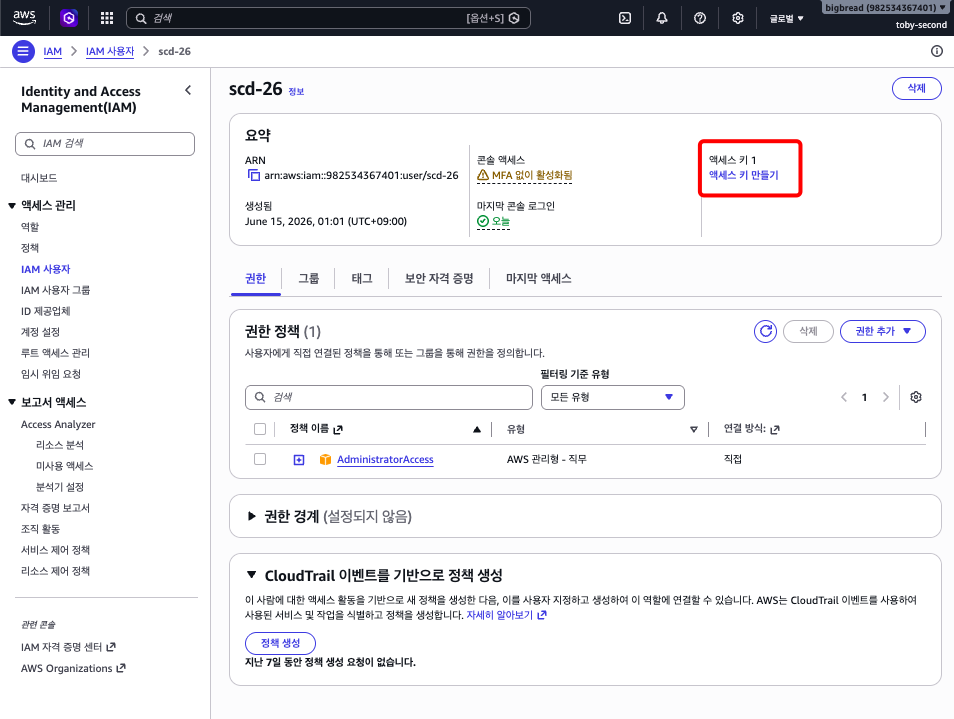

3. Use case에서 **Command Line Interface (CLI)** 선택 → **Next** (설명 태그 값은 공란)
4. **Create access key** 클릭

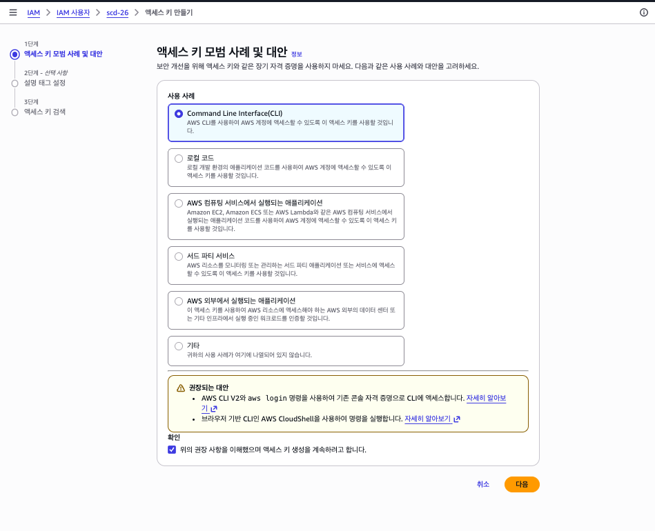

5. **Access Key ID**와 **Secret Access Key**를 안전한 곳에 복사해 둡니다

!!! warning "주의"
    Secret Access Key는 이 화면에서만 확인 가능합니다. 반드시 복사해 두세요.

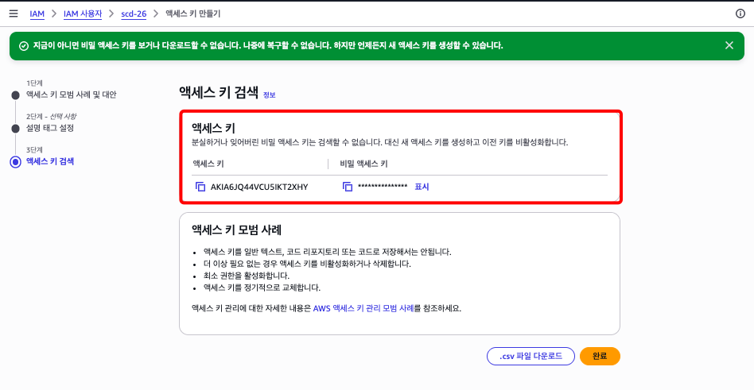

### AWS CLI 자격증명 등록

```bash
aws configure
```

다음과 같이 입력하세요:

```
AWS Access Key ID [None]: <위에서 복사한 Access Key ID>
AWS Secret Access Key [None]: <위에서 복사한 Secret Access Key>
Default region name [None]: ap-northeast-2
Default output format [None]: json
```

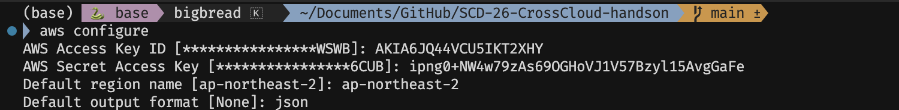

등록 확인:
```bash
aws sts get-caller-identity
```

아래와 같이 계정 정보가 출력되면 성공입니다:
```json
{
    "UserId": "AIDAXXXXXXXXXXXX",
    "Account": "123456789012",
    "Arn": "arn:aws:iam::123456789012:user/scd26-admin"
}
```

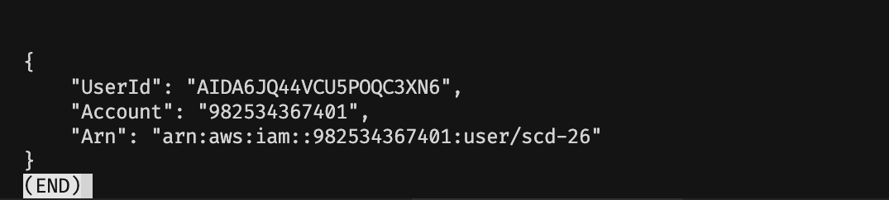

## 0-3. 리전 설정

이번 핸즈온은 **`ap-northeast-2` (서울)** 리전에서 진행합니다.

- `aws configure`에서 이미 `ap-northeast-2`를 입력했다면, CLI는 준비 완료입니다.
- **AWS 콘솔**에서도 우측 상단의 리전 선택 드롭다운에서 **Asia Pacific (Seoul) ap-northeast-2**를 선택하세요.

!!! warning "리전 주의"
    콘솔과 CLI 모두 리전이 `ap-northeast-2`인지 반드시 확인하세요.
    다른 리전에서 리소스를 생성하면 이후 단계에서 오류가 발생합니다.

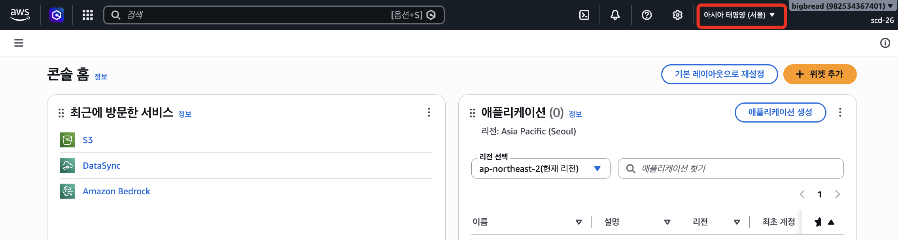

## 0-4. Bedrock 모델 확인

!!! info "Model access 페이지 폐지 안내"
    AWS가 Bedrock Model access 페이지를 폐지했습니다. 이제 대부분의 모델은 **처음 호출 시 자동으로 활성화**됩니다. 단, **Anthropic Claude**는 최초 사용 시 사용 사례 양식 제출이 필요합니다.

### 이번 핸즈온에서 사용하는 모델

| 모델 | 용도 | 비고 |
|------|------|------|
| **Amazon Titan Text Embeddings V2** | 문서 임베딩 (벡터 변환) | 자동 활성화 |
| **Anthropic Claude 3.5 Sonnet** | 챗봇 응답 생성 | 최초 사용 시 양식 제출 필요 |

### Anthropic Claude 사용 설정

1. AWS 콘솔에서 **Amazon Bedrock** 서비스로 이동합니다
2. 좌측 메뉴에서 **모델 카탈로그**를 클릭합니다
3. **Claude 3.5 Sonnet**을 검색해 클릭합니다

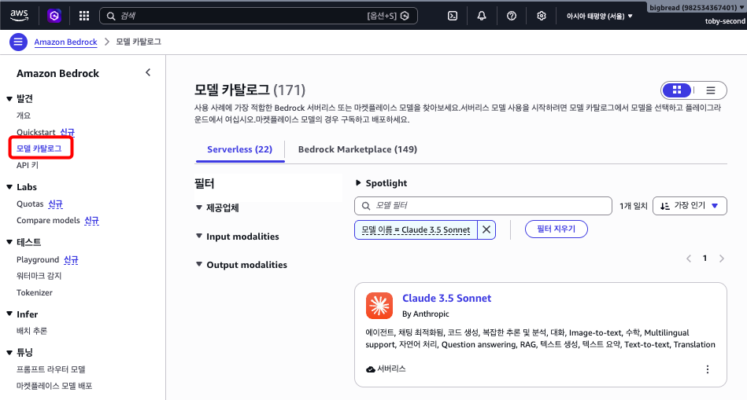

4. **Open in playground** (또는 **Try in playground**)를 클릭하면 사용 사례 양식 입력 창이 뜹니다. 버튼이 보이지 않으면 **Request model access** 버튼을 클릭하세요

!!! info "양식 제출 후"
    제출하면 액세스가 **즉시 부여**됩니다. 핸즈온 시작 전에 미리 확인해 두세요.

## 0-5. IAM 권한 확인

핸즈온에서 사용하는 서비스에 대한 권한이 필요합니다.

### 개인 계정인 경우

Admin 권한이 있으므로 별도 설정이 필요 없습니다.

### 조직 계정인 경우

아래 서비스에 대한 접근 권한이 있는지 확인하세요:
- Amazon S3 (버킷 생성/삭제)
- AWS DataSync (태스크 생성/실행)
- Amazon Bedrock (Knowledge Base 생성, 모델 호출)
- IAM (역할 생성: Bedrock이 S3에 접근할 때 필요)

## 0-6. 준비 완료 체크리스트

핸즈온 당일, 시작하기 전에 확인하세요:

- [ ] AWS 콘솔에 **IAM 사용자**로 로그인 완료 (루트 사용자 X)
- [ ] 리전이 `ap-northeast-2` (서울)로 설정됨 (콘솔)
- [ ] Bedrock에서 **Anthropic Claude 3.5 Sonnet** 사용 가능 (사용 사례 양식 제출 완료)
- [ ] S3, DataSync, Bedrock 서비스에 접근 가능

**로컬에서 CLI 스크립트를 실행할 경우에만 (선택)**

- [ ] AWS CLI v2 설치 완료 (`aws --version` 확인)
- [ ] `aws configure` 완료 (`aws sts get-caller-identity` 확인)
- [ ] CLI 리전도 `ap-northeast-2`로 설정됨

> CloudShell에서 스크립트를 실행하면 위 3가지(설치·자격증명·CLI 리전)는 자동으로 충족됩니다.

---

**다음 단계**: [Module 1 : GCS → S3 전송](01-datasync-gcs-to-s3.md)
