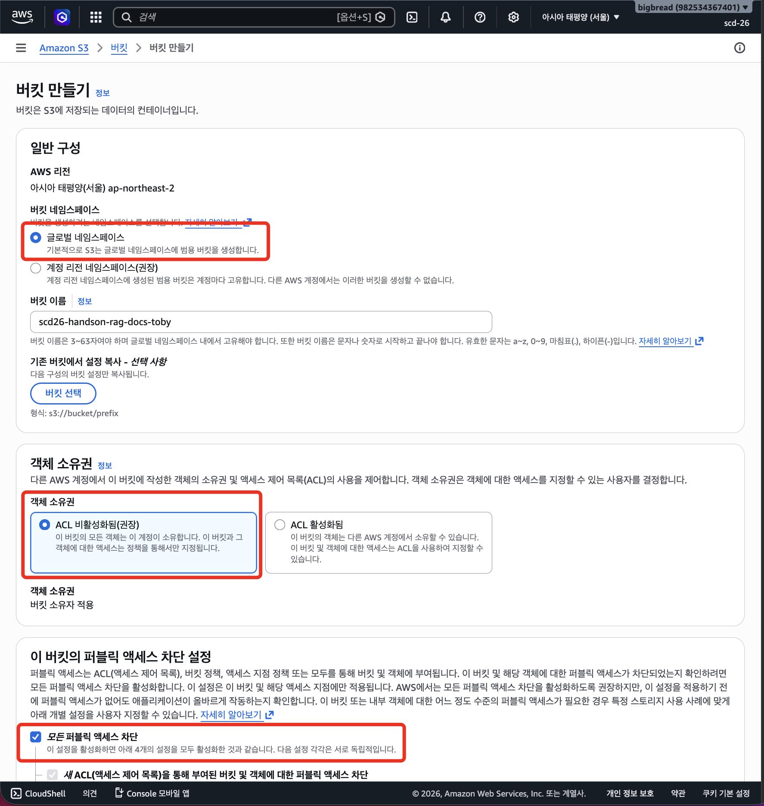
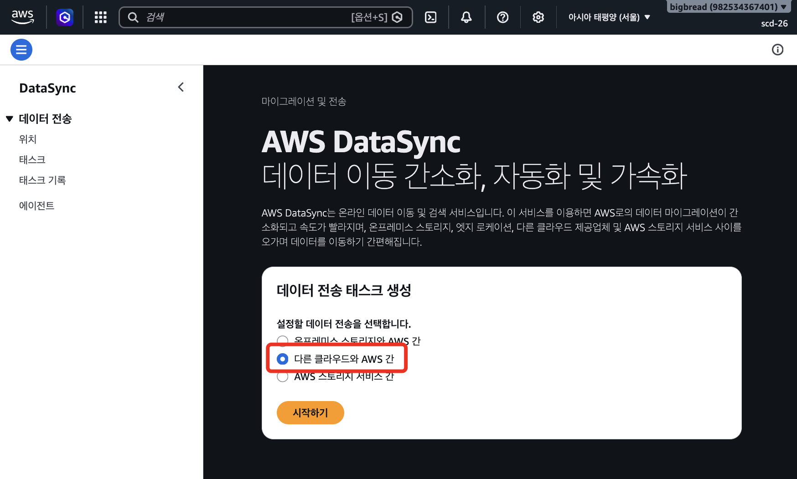
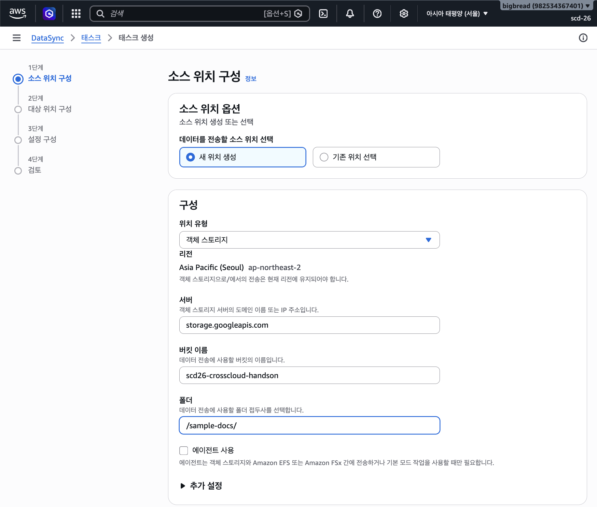
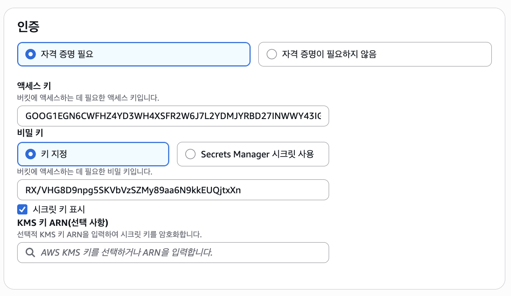
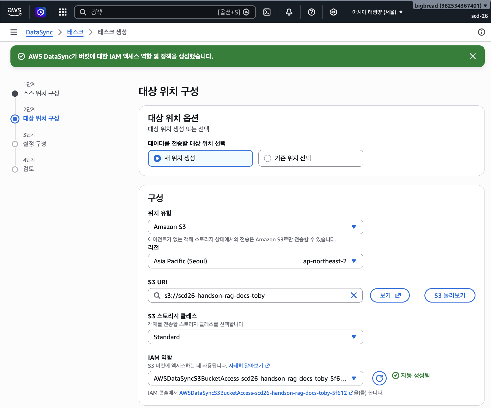
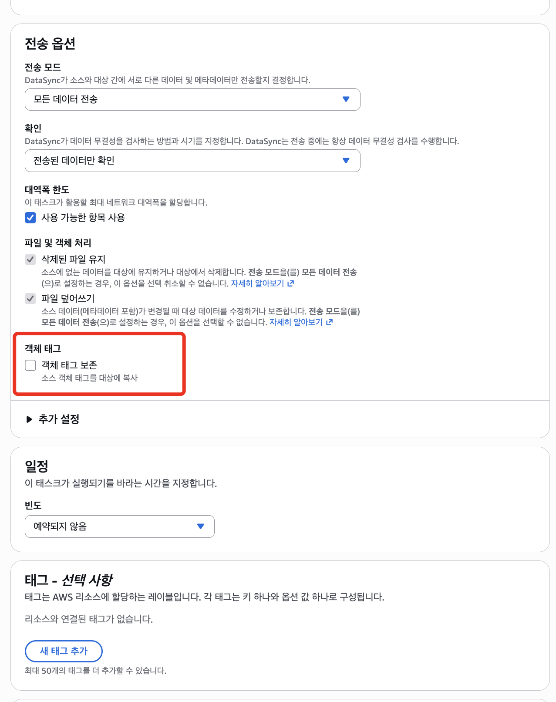
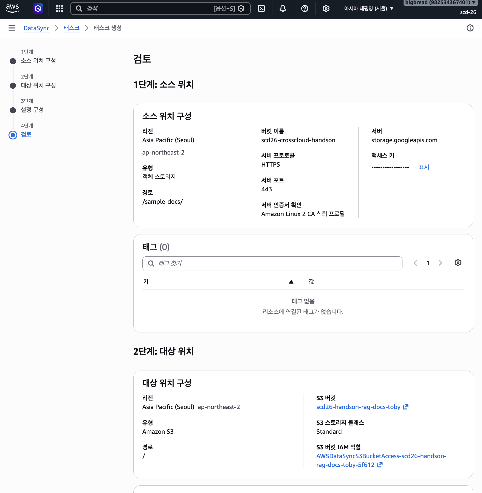
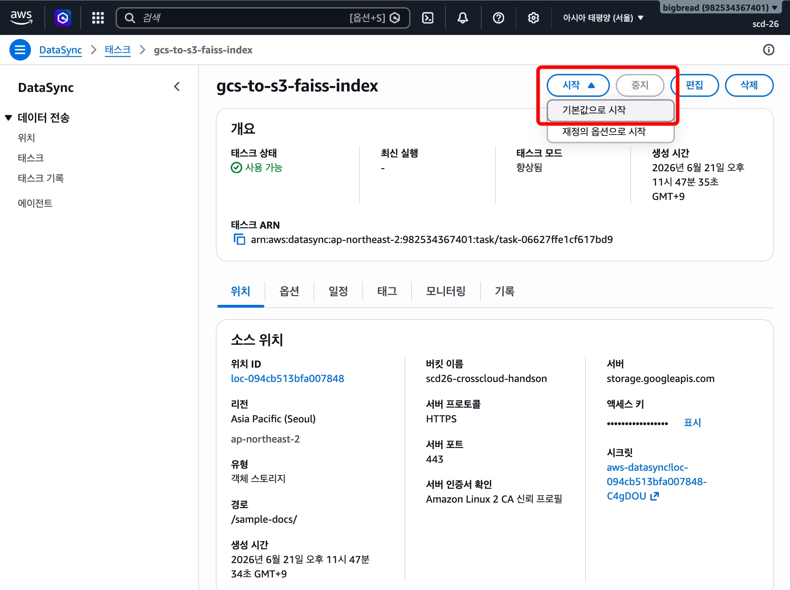
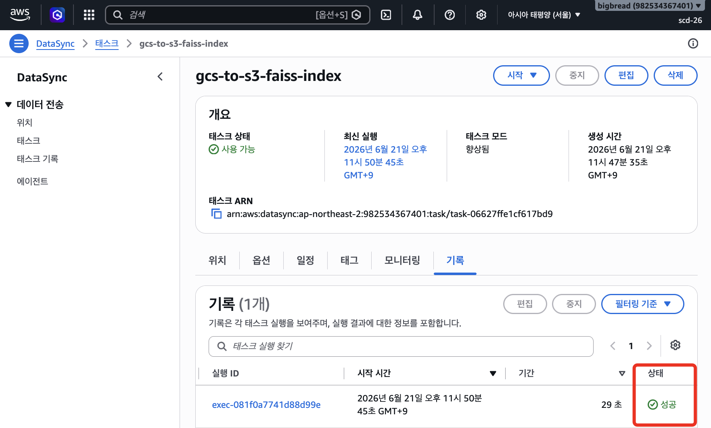
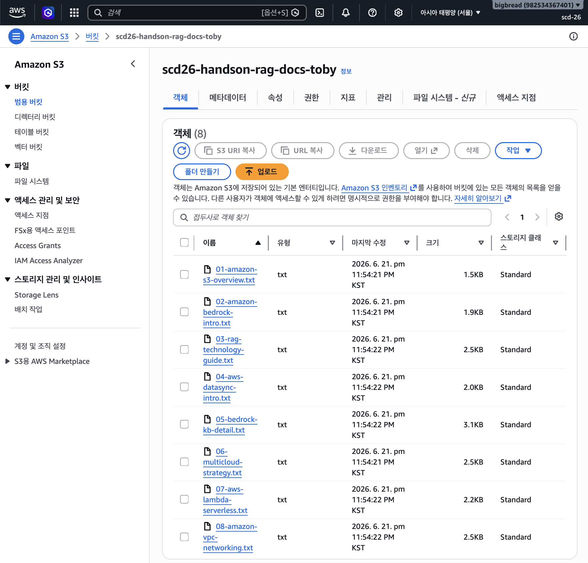

# Module 1: GCS에서 S3로 문서 전송 (AWS DataSync)

> **소요 시간**: 약 10분
>
> **목표**: Google Cloud Storage(GCS)에 있는 RAG용 문서를 AWS DataSync를 사용하여 Amazon S3 버킷으로 동기화합니다.

## 핵심 개념

**AWS DataSync**는 AWS와 다른 스토리지 시스템 간의 데이터 전송을 자동화하는 서비스입니다.
GCS는 S3 호환 API를 제공하므로, DataSync의 **Object Storage** 위치 유형을 사용하여 GCS 버킷에 접근할 수 있습니다.

```
GCS Bucket (소스) ─▶ HMAC Key 인증 ─▶ AWS DataSync  ─▶ S3 Bucket (대상)
```

## 1-1. S3 버킷 생성 (전송 대상)

먼저 문서를 받을 S3 버킷을 생성합니다.

1. AWS 콘솔에서 **S3** 서비스로 이동합니다
2. **Create bucket** 클릭
3. 다음과 같이 설정해 버킷을 만듭니다:

| 항목 | 값 |
|------|-----|
| Bucket name | `scd26-handson-rag-docs-{본인이니셜}` (예: `scd26-handson-rag-docs-toby`) |
| AWS Region | **Asia Pacific (Seoul) ap-northeast-2** |
| Object Ownership | ACLs disabled (기본값) |
| Block Public Access | 모두 차단 (기본값) |

4. 나머지 설정은 기본값 유지 → **Create bucket** 클릭 (이름 입력 후, 아무것도 설정하지 말기)



> **버킷 이름은 고유**해야 합니다. 이니셜이나 날짜를 붙여서 중복을 방지하세요.

## 1-2. HMAC Key 정보 확인

GCS에 접근하기 위해 **HMAC(Hash-based Message Authentication Code) 키**가 필요합니다.
HMAC 키는 S3 호환 API 형태의 Access Key / Secret Key 쌍입니다.

>  아래 정보는 AWS Datasync Task를 설정할때 필요합니다. 복사하여 사용하세요.

| 항목 | 값 |
|------|-----|
| Server URL | `https://storage.googleapis.com` |
| GCS Bucket Name | scd26-crosscloud-handson |
| Access Key | (진행자가 당일 안내) |
| Secret Key | (진행자가 당일 안내) |

!!! warning "주의"
    HMAC 키를 입력할 때 앞뒤 공백이 들어가지 않도록 주의하세요. 한 글자라도 틀리면 인증 실패가 발생합니다.

## 1-3. DataSync 소스 위치 생성 (GCS)



1. AWS 콘솔에서 **DataSync** 서비스로 이동합니다
2. 좌측 메뉴에서 **Data transfer** → **Locations** 클릭
3. **Create location** 클릭
4. 다음과 같이 입력합니다:



| 항목 | 값 |
|------|-----|
| Location type | **Object storage** |
| Agent | 선택 안 함 (퍼블릭 엔드포인트 사용) |
| Server URL | `https://storage.googleapis.com` |
| Bucket name | scd26-crosscloud-handson |
| Folder | `/sample-docs/` |

5. **인증** 섹션

> 아래 사진과 같이 **엑세스 키, 비밀 키** 입력 외엔 기본 설정을 유지합니다. 기입 후, 다음 버튼 클릭합니다.



| 항목 | 값 |
|------|-----|
| Access key | (진행자가 당일 안내) |
| Secret key | (진행자가 당일 안내) |

## 1-4. DataSync 대상 위치 생성 (S3)

1. **대상 위치 구성** 페이지에서 다시 **새 위치 생성** 클릭
2. 다음과 같이 입력합니다. 입력 후, 다음 버튼을 클릭합니다. 

| 항목 | 값 |
|------|-----|
| 위치 유형 | **Amazon S3** |
| 리전 | **Asia Pacific (Seoul, ap-northeast-2)** |
| S3 bucket | **s3 둘러보기** 클릭 하여 생성한 버킷 (scd26-crosscloud-handson) 선택 |
| S3 스토리지 클래스 | Standard (기본값) |
| IAM 역할 | **Auto generate** (자동 생성) 하여 할당 |

3. **Create location** 클릭



## 1-5. DataSync 태스크 설정 구성

1. **설정 구성** 페이지에서 **태스크 모드**, 향상됨 클릭
- **Enhanced** (향상됨): 에이전트 없이 S3와 타 클라우드 간 전송 지원
2. Task 이름을 입력합니다. (선택사항) ex: scd26-gcs-to-s3-transfer



| 항목 | 값 |
|------|-----|
| Transfer mode | **모든 데이터 전송** |
| Verification | **전송된 데이터만 확인** (기본값) |
| Bandwidth limit | **사용 가능한 항목 사용** (기본값) |
| Keep deleted files | **유지** (기본값) |
| Object tags | **체크 해제 (Do not copy)** ⚠️ |
| Schedule | **Not scheduled** (기본값) |
| 나머지 | 기본값 유지 |

!!! info "삭제된 파일 유지 / 파일 덮어쓰기는 자동 고정됩니다"
    **전송 모드**를 `모든 데이터 전송(ALL)`으로 선택하면, 콘솔이 아래 두 옵션을 자동으로 체크·잠금 처리하므로 **그대로 두면 됩니다**.

    - **삭제된 파일 유지** → 강제 `유지(PRESERVE)`. ALL 모드는 대상(S3)을 스캔하지 않아 무엇을 지울지 알 수 없으므로 "삭제"를 선택할 수 없습니다. (S3에만 있고 GCS에 없는 파일은 삭제되지 않고 보존)
    - **파일 덮어쓰기** → 비교 없이 소스 전체를 복사하므로 사실상 항상 덮어쓰며, 토글이 비활성화됩니다.

!!! danger "필수 확인"
    Object tags(객체 태그 보존) 옵션이 보이면 반드시 **체크 해제**하세요.
    GCS는 S3 태그를 지원하지 않기 때문에 체크되어 있으면 전송이 실패합니다

> **참고**: Enhanced(향상됨) 모드는 에이전트 없이 S3와 다른 클라우드 간 직접 전송을 지원합니다.
> 기본(Basic) 모드보다 성능이 높고, 태스크 생성 후 모드 변경은 불가합니다.

3. 입력 후, 하단의 다음 버튼을 클릭합니다. 
- 설정을 확인하고 **Create task** 클릭



4. 태스크가 생성되면 **Start** → **Start with defaults** 클릭하여 전송을 시작합니다



## 1-6. 전송 결과 확인

1. 태스크 실행 후 약 **30초~1분**이면 완료됩니다 (8개 파일, 18.5KB 기준)
2. **태스크 하단 기록** 탭에서 실행 결과를 확인합니다:
   - Status: **Success**
   - Files transferred: 8개 (샘플 문서 수)
   - Bytes transferred: 18,548 bytes



3. **S3 콘솔**에서 버킷 루트에 8개 TXT 파일이 있는지 확인합니다



## 트러블슈팅

| 증상 | 원인 | 해결 |
|------|------|------|
| `InvalidAccessKeyId` | HMAC Access Key 오타 | 키를 다시 복사하여 붙여넣기 |
| `SignatureDoesNotMatch` | HMAC Secret Key 오타 또는 공백 | 키 앞뒤 공백 제거 후 재입력 |
| Task가 UNAVAILABLE | 소스 위치 접근 불가 | Server URL이 `https://storage.googleapis.com`인지 확인 |
| Files transferred: 0 | 폴더 경로 오류 | GCS 버킷의 폴더 경로가 정확한지 진행자에게 확인 |
| S3 대상 위치 생성 실패 (`s3:ListBucket` 권한) | IAM 역할 자동 생성 지연 | 1분 대기 후 **Auto generate** 다시 선택하여 재시도 |

## 막혔을 때 복구 방법 - 스크립트 실행하여 설정 

> 콘솔에서 일부 단계를 놓쳤거나 잘못 설정했다면, 아래 스크립트를 실행하여 복구하세요

아래 제공하는 스크립트는 **있으면 재사용 / 없으면 생성**하는 멱등(idempotent) 방식이라,
콘솔에서 만들다 멈췄거나 처음부터 다시 하려는 경우 **그냥 실행하면 됩니다.**
빠진 리소스만 채워 정상화하고 전송까지 완료하며, **여러 번 실행해도 리소스가 중복 생성되지 않습니다.**
실행이 끝나면 `[새로 생성됨] / [기존 재사용됨]` 목록과 전송 결과를 보여줍니다.

??? example "자동 복구 스크립트 실행 (CloudShell / 로컬)"

    이 스크립트는 Module 1 전체(S3 버킷·IAM 역할·DataSync 위치/태스크·전송)를 자동 구성·복구합니다.
    **AWS CloudShell** (설치·인증 불필요) 또는 **로컬 AWS CLI** 중 편한 환경을 선택하세요.

    === "AWS CloudShell (권장)"

        별도 설치 없이 브라우저에서 바로 실행할 수 있습니다.

        **준비**

        1. AWS 콘솔 우측 상단의 **CloudShell**(터미널 아이콘)을 클릭합니다
        2. AWS CLI v2 · `git` · 콘솔 로그인 자격증명이 **자동 적용**되므로 `aws configure`는 **불필요**합니다
        3. 이 스크립트는 CloudShell 표시 리전과 무관하게 **항상 서울(ap-northeast-2)**에 리소스를 생성합니다.
           나중에 콘솔에서 리소스를 찾을 때는 리전을 **서울**로 맞춰서 확인하세요

        **실행**
        ```bash
        git clone https://github.com/Daehyun-Bigbread/SCD-26-CrossCloud-handson.git
        cd SCD-26-CrossCloud-handson
        bash scripts/setup-module1-datasync.sh
        ```

    === "로컬 AWS CLI"

        내 PC 터미널에서 실행합니다.

        !!! warning "Windows 사용자"
            이 스크립트는 bash 전용 문법을 사용하므로 **cmd·PowerShell에서는 실행되지 않습니다.**
            **Git Bash**(Git for Windows에 포함) 또는 **WSL**에서 실행하세요.
            (가장 쉬운 길은 OS 영향이 없는 **CloudShell 탭** 사용입니다.)

        **준비**

        1. **AWS CLI v2 설치** — [공식 설치 가이드](https://docs.aws.amazon.com/cli/latest/userguide/getting-started-install.html)
        2. **`aws configure`** 로 IAM 사용자의 Access Key / Secret Key와 리전(`ap-northeast-2`)을 설정합니다
        3. `aws sts get-caller-identity` 로 인증이 정상인지 확인합니다

        **실행** (Mac/Linux: 터미널 · Windows: Git Bash 또는 WSL)
        ```bash
        git clone https://github.com/Daehyun-Bigbread/SCD-26-CrossCloud-handson.git
        cd SCD-26-CrossCloud-handson
        bash scripts/setup-module1-datasync.sh
        ```

    !!! info "공통 — 필요한 IAM 권한"
        로그인(또는 IAM) 사용자에게 다음 권한이 필요합니다:

        ```
        s3:CreateBucket, s3:ListBucket,
        iam:CreateRole, iam:GetRole, iam:PutRolePolicy, iam:PassRole,
        datasync:*
        ```

        - **`iam:PassRole`** 은 DataSync S3 대상 위치 생성 단계에서 필수입니다(누락 시 `AccessDenied`로 실패).
        - 가장 간단하게는 관리형 정책 **`AmazonS3FullAccess` + `AWSDataSyncFullAccess` + `IAMFullAccess`** (또는 `AdministratorAccess`)로 진행하면 됩니다.

    !!! warning "스크립트를 콘솔에 통째로 복사·붙여넣기 하지 마세요"
        이 스크립트는 `read`로 대화형 입력을 받기 때문에, 본문 전체를 한 번에 붙여넣으면
        뒤 라인이 입력값으로 빨려 들어가고, `set -euo pipefail`로 인해 첫 실패에서 현재 셸이 종료됩니다.
        반드시 위처럼 **파일로 저장(클론)한 뒤 `bash`로 실행**하세요.

    **스크립트가 수행하는 작업** (`scripts/setup-module1-datasync.sh`)

    1. S3 버킷 생성 (전송 대상)
    2. DataSync용 IAM 역할 생성 + S3 접근 정책 부여
    3. DataSync 위치 생성 — 소스(GCS, HMAC 인증) + 대상(S3)
    4. DataSync 태스크 생성·실행 후 전송 완료까지 대기, 결과 파일 수 확인

    > 전체 코드는 저장소의 [`scripts/setup-module1-datasync.sh`](https://github.com/Daehyun-Bigbread/SCD-26-CrossCloud-handson/blob/main/scripts/setup-module1-datasync.sh)에서 확인할 수 있습니다.

---

**이전**: [Module 0: 사전 준비](00-prerequisites.md) | **다음**: [Module 2: Bedrock Knowledge Bases](02-bedrock-kb-create.md)
