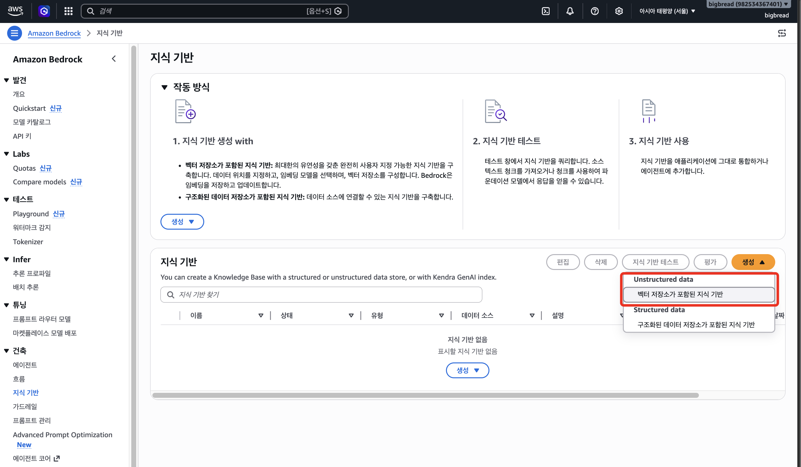
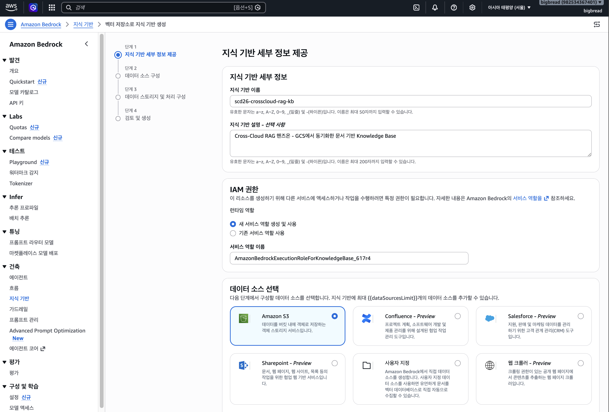
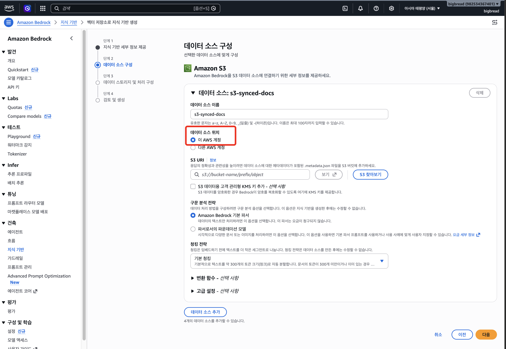
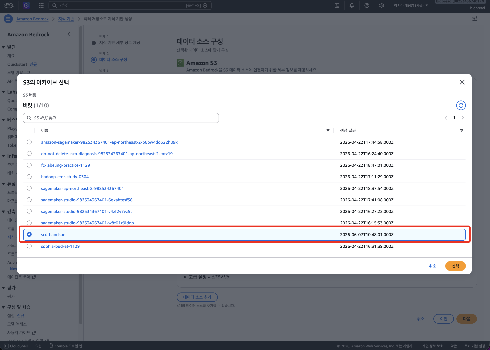
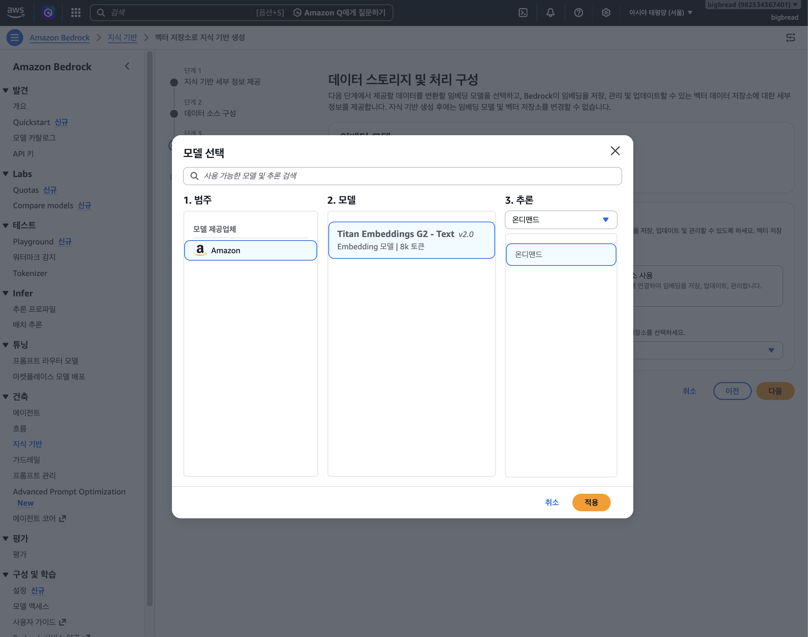
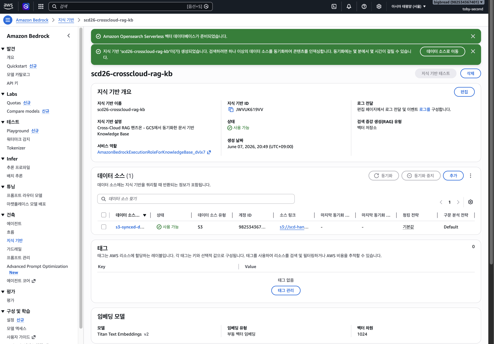
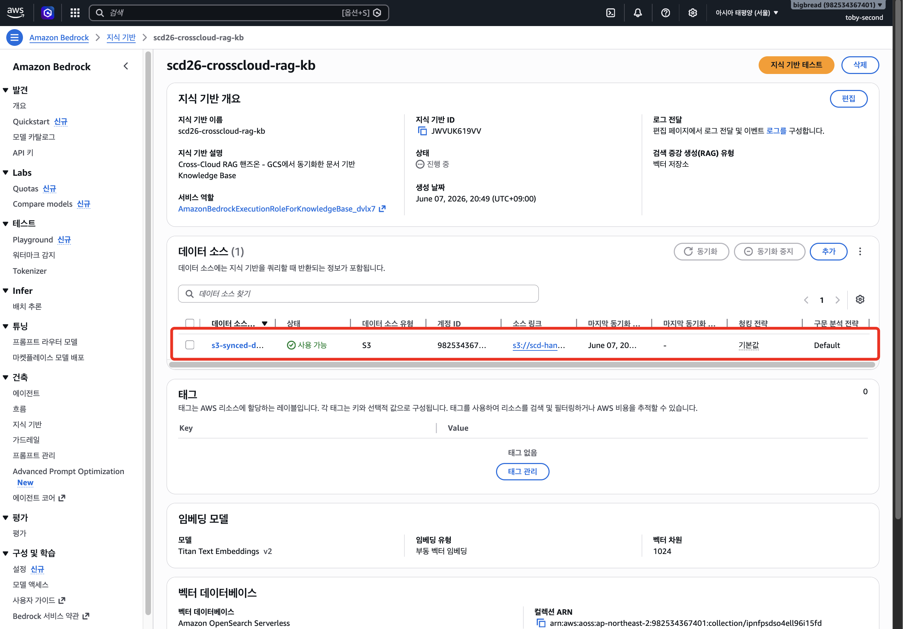
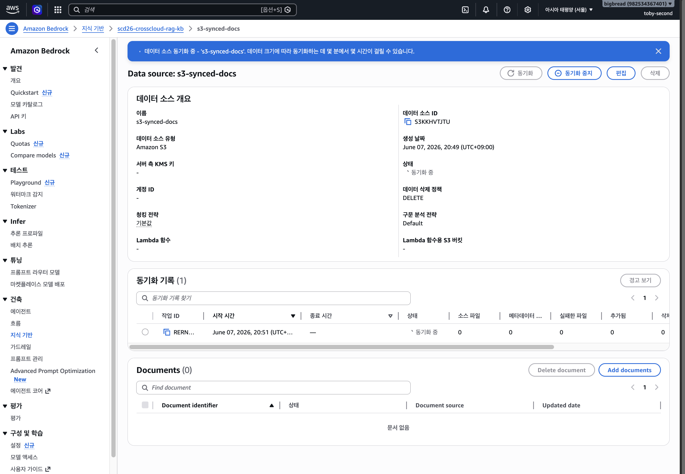
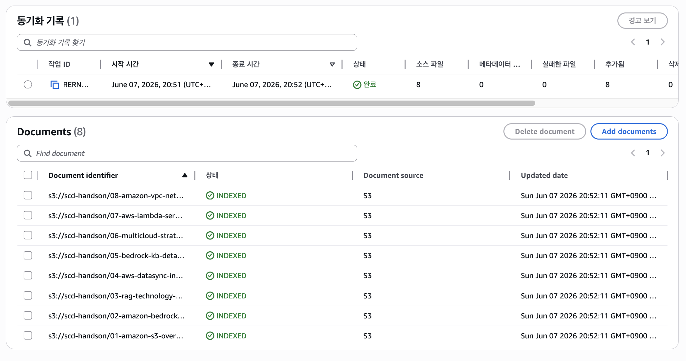
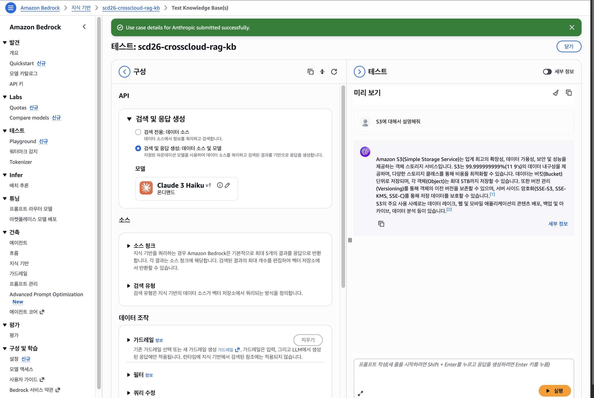

# Module 2 — Amazon Bedrock Knowledge Bases 생성

> **소요 시간**: 약 15분
>
> **목표**: S3에 저장된 문서를 데이터 소스로 하는 Bedrock Knowledge Base를 생성하고, 문서를 임베딩하여 벡터 인덱스로 동기화합니다.

## 핵심 개념

[**Amazon Bedrock Knowledge Bases**](https://aws.amazon.com/ko/bedrock/knowledge-bases/)는 RAG 파이프라인을 자동으로 구축해주는 매니지드 서비스입니다.

검색 증강 생성(RAG)은 회사 데이터 소스에서 가져온 컨텍스트로 프롬프트를 보강해, 파운데이션 모델이 더 관련성 높고 정확한 맞춤형 응답을 내도록 하는 기술입니다. Bedrock Knowledge Bases는 세션 컨텍스트 관리와 소스 속성(인용) 기능을 내장한 완전관리형 서비스로, 데이터 소스에 대한 맞춤형 통합을 직접 구축하거나 데이터 흐름을 관리하지 않아도 수집부터 검색·프롬프트 증강까지 전체 RAG 워크플로를 구현하도록 돕습니다.

```
S3 (문서) → Bedrock KB → [파싱 → 청킹 → 임베딩 → 벡터 저장] → 검색 가능한 지식 기반
```

기존에 직접 구현해야 했던 과정들을 Bedrock KB가 자동으로 처리합니다:

| 단계 | 직접 구현 시 | Bedrock KB 사용 시 |
|------|-------------|-------------------|
| 문서 파싱 | PyMuPDF, BeautifulSoup 등 | 자동 (PDF, TXT, HTML 등 지원) |
| 청킹 | kss, tiktoken 등으로 직접 분할 | 자동 (기본 300 토큰 청킹) |
| 임베딩 | OpenAI API 호출 등 | Titan Embeddings V2 자동 호출 |
| 벡터 저장 | FAISS, ChromaDB 등 직접 관리 | OpenSearch Serverless 자동 생성 |

## 사용하는 AWS 서비스

| 서비스 | 역할 | 비고 |
|--------|------|------|
| **Amazon Bedrock** | Knowledge Base 생성 및 관리 | 매니지드 RAG 파이프라인 |
| **Amazon Titan Text Embeddings V2** | 문서 → 1024차원 벡터 변환 | 임베딩 모델 |
| **Amazon OpenSearch Serverless** | 벡터 인덱스 저장 및 검색 | Quick Create로 자동 생성 |
| **Anthropic Claude 3.5 Sonnet** | 검색된 문서 기반 답변 생성 | KB 테스트 패널에서 사용 |

## 2-1. Knowledge Base 생성

1. AWS 콘솔에서 **Amazon Bedrock** 서비스로 이동합니다
2. 좌측 메뉴에서 **빌더 도구(Builder tools)** → **지식 기반** 클릭
3. **지식 기반 생성** 클릭
4. **Unstructed data** 아래 **벡터 저장소가 포함된 지식 기반** 클릭



### Step 1: 지식 기반 세부 정보

- 아래 표에 적힌대로 기입합니다.

| 항목 | 값 |
|------|-----|
| 지식 기반 이름| `scd26-crosscloud-rag-kb` |
| 지식 기반 설명 - 선택 사항 | `Cross-Cloud RAG 핸즈온 - GCS에서 동기화한 문서 기반 Knowledge Base` |
| IAM permissions (IAM 권한) | **새 서비스 역할 생성 및 사용** |

**다음** 클릭



### Step 2: 데이터 소스 구성

| 항목 | 값 |
|------|-----|
| Data source name | `s3-synced-docs` |
| Data source 위치 | `이 AWS 계정` |
| S3 URI | **Browse S3** 클릭 → Module 1에서 생성한 버킷 선택 |




> S3 URI 형식: `s3://{본인 버킷 이름}/` (버킷 루트 전체 선택)

**구문 분석 전략**: Amazon Bedrock 기본 파서 
**청킹 전략(Chunking strategy)** (Advanced settings):

| 항목 | 값 |
|------|-----|
| Chunking strategy | **기본 청깅 (Default chunking)**|

> 기본 청킹은 300 토큰 단위로 문서를 나눕니다. 입문 핸즈온에서는 기본값이 적합합니다.

**다음** 클릭

### Step 3: 데이터 스토리지 및 처리 구성

| 항목 | 값 |
|------|-----|
| Embeddings model | **Titan Text Embeddings V2** |
| Vector dimensions | 1024 (기본값) |
| Vector database | **새로운 벡터 저장소 빠른 생성 - 권장** |
| Vector store | **Amazon OpenSearch Serverless** 선택 |

> **Quick create**를 선택하면 OpenSearch Serverless 컬렉션이 자동으로 생성됩니다.
> 수동 설정 대비 약 15분의 시간을 절약할 수 있습니다.



**다음** 클릭

### Step 4: 검토 및 생성

- 모든 설정을 확인하고 **지식 기반 생성** 클릭
- Knowledge Base 생성에 약 **3~5분**이 소요됩니다



!!! danger "과금 주의"
    OpenSearch Serverless 컬렉션이 함께 생성되므로 이 시점부터 **시간당 과금**이 시작됩니다.
    핸즈온이 끝나면 반드시 [Module 3 — RAG 챗봇 테스트 & 리소스 정리](03-chatbot-test.md)의 리소스 정리를 진행하세요.

## 2-2. 데이터 소스 동기화 (Sync)

Knowledge Base가 생성되면 S3의 문서를 임베딩하여 벡터 인덱스에 저장해야 합니다.

1. 생성된 Knowledge Base 상세 페이지로 이동합니다
2. **Data source** 섹션에서 `s3-synced-docs` 데이터 소스를 선택합니다
3. **동기화(Sync)** 버튼을 클릭합니다



4. 동기화 상태가 진행됩니다:
   - **Syncing** → 문서 파싱 및 임베딩 중
   - **Available** → 동기화 완료



> 동기화는 약 **3~5분** 소요됩니다. 문서 수와 크기에 따라 다를 수 있습니다.

## 2-3. 동기화 결과 확인

동기화가 완료되면:

1. **Data source** 섹션에서 Sync 상태가 **Completed**인지 확인합니다
2. **Sync history**를 클릭하면 상세 결과를 볼 수 있습니다:
   - Number of source documents synced
   - Number of source documents failed
   - Number of new/modified/deleted chunks



> 만약 실패한 문서가 있다면 파일 형식이 지원되는지 확인하세요.
> Bedrock KB는 PDF, TXT, HTML, MD, CSV, DOC/DOCX, XLS/XLSX 형식을 지원합니다.

## 2-4. Knowledge Base 테스트 (간단 확인)

동기화가 완료되면 바로 테스트할 수 있습니다.

1. Knowledge Base 상세 페이지 우측의 **Test knowledge base** 패널을 확인합니다
2. **Select model** 에서 **Anthropic Claude 3.5 Sonnet** (또는 Claude 3 Haiku)를 선택합니다
3. 간단한 질문을 입력해봅니다:

```
이 문서들은 어떤 내용을 다루고 있나요?
```

4. 응답이 S3에 업로드한 문서 내용을 참조하여 답변하는지 확인합니다



## 내부 동작 이해

Bedrock KB가 내부적으로 수행하는 RAG 파이프라인:

```
1. 파싱 (Parsing)
   S3 문서 → 텍스트 추출 (PDF 구조, 테이블, 이미지 OCR 등)

2. 청킹 (Chunking)  
   텍스트 → 300 토큰 단위로 분할 (문맥 보존)

3. 임베딩 (Embedding)
   각 청크 → Titan Embeddings V2 → 1024차원 벡터

4. 인덱싱 (Indexing)
   벡터 → OpenSearch Serverless 컬렉션에 저장

5. 검색 (Retrieval, 질의 시)
   질문 → 임베딩 → 유사 벡터 검색 → 관련 청크 반환

6. 생성 (Generation, 질의 시)
   관련 청크 + 질문 → LLM → 답변 생성
```

## 트러블슈팅

| 증상 | 원인 | 해결 |
|------|------|------|
| KB 생성 시 "루트 사용자 지원 안 됨" | 루트 사용자로 로그인 | IAM 사용자로 로그인 후 재시도 (Module 0 참고) |
| KB 생성 시 IAM 오류 | 역할 생성 권한 없음 | Admin 권한 확인, 또는 수동으로 역할 생성 |
| Sync 실패 | S3 버킷 접근 불가 | S3 URI 경로 확인, 리전이 us-west-2인지 확인 |
| Sync 시 문서 0건 | 폴더 경로 오류 | S3 URI가 `s3://버킷명/`인지 확인 (버킷 루트) |
| 테스트 시 "모델 접근 불가" | Bedrock 모델 미승인 | Module 0의 모델 액세스 상태 재확인 |
| 리전 불일치 | 다른 리전에서 KB 생성 | 콘솔 우측 상단 리전이 `us-west-2`인지 확인 |

??? example "CLI 스크립트로 자동 구축 (복사/붙여넣기용)"

    콘솔 대신 AWS CLI로 Module 2 전체를 자동 실행할 수 있습니다.
    아래 스크립트를 터미널에 복사하여 실행하세요.

    **사전 요구사항**: Module 1 완료 (S3 버킷에 문서 존재), Bedrock 모델 액세스 승인 완료

    **실행 방법**:
    ```bash
    chmod +x scripts/setup-module2-bedrock-kb.sh
    ./scripts/setup-module2-bedrock-kb.sh
    ```

    **전체 스크립트**:
    ```bash
    #!/bin/bash
    set -euo pipefail

    REGION="${REGION:-${AWS_REGION:-${AWS_DEFAULT_REGION:-us-west-2}}}"

    echo "============================================"
    echo "  Module 2 — Bedrock Knowledge Base 생성"
    echo "============================================"

    # ─── 사용자 입력 ─────────────────────────────────────────
    read -rp "S3 버킷 이름 (Module 1에서 생성한 버킷): " S3_BUCKET

    FILE_COUNT=$(aws s3 ls "s3://$S3_BUCKET/" --region "$REGION" 2>/dev/null | wc -l | tr -d ' ')
    if [[ "$FILE_COUNT" -eq 0 ]]; then
      echo "✗ S3 버킷에 파일이 없습니다. Module 1을 먼저 실행하세요."
      exit 1
    fi
    echo "✓ S3 버킷 확인: ${FILE_COUNT}개 파일"

    # ─── Step 1: Bedrock KB용 IAM 역할 생성 ──────────────────
    echo "━━━ [1/4] Bedrock KB용 IAM 역할 생성 ━━━"
    ACCOUNT_ID=$(aws sts get-caller-identity --query 'Account' --output text)
    KB_ROLE_NAME="AmazonBedrockKBRole-scd26-handson"

    KB_ROLE_ARN=$(aws iam create-role \
      --role-name "$KB_ROLE_NAME" \
      --assume-role-policy-document '{
        "Version": "2012-10-17",
        "Statement": [{
          "Effect": "Allow",
          "Principal": { "Service": "bedrock.amazonaws.com" },
          "Action": "sts:AssumeRole"
        }]
      }' \
      --query 'Role.Arn' --output text 2>/dev/null) || \
    KB_ROLE_ARN=$(aws iam get-role \
      --role-name "$KB_ROLE_NAME" \
      --query 'Role.Arn' --output text)

    aws iam put-role-policy \
      --role-name "$KB_ROLE_NAME" \
      --policy-name "BedrockKBAccess" \
      --policy-document '{
        "Version": "2012-10-17",
        "Statement": [
          {
            "Effect": "Allow",
            "Action": ["s3:GetObject","s3:ListBucket"],
            "Resource": ["arn:aws:s3:::'"$S3_BUCKET"'","arn:aws:s3:::'"$S3_BUCKET"'/*"]
          },
          {
            "Effect": "Allow",
            "Action": ["bedrock:InvokeModel"],
            "Resource": "arn:aws:bedrock:'"$REGION"'::foundation-model/amazon.titan-embed-text-v2:0"
          }
        ]
      }'

    aws iam put-role-policy \
      --role-name "$KB_ROLE_NAME" \
      --policy-name "BedrockKBAOSS" \
      --policy-document '{
        "Version": "2012-10-17",
        "Statement": [{
          "Effect": "Allow",
          "Action": ["aoss:APIAccessAll"],
          "Resource": "arn:aws:aoss:'"$REGION"':'"$ACCOUNT_ID"':collection/*"
        }]
      }'
    echo "✓ IAM 역할 생성 완료"
    sleep 15

    # ─── Step 2: Knowledge Base 생성 ─────────────────────────
    echo "━━━ [2/4] Knowledge Base 생성 (3~5분 소요) ━━━"
    KB_RESULT=$(aws bedrock-agent create-knowledge-base \
      --name "scd26-crosscloud-rag-kb" \
      --description "Cross-Cloud RAG 핸즈온 KB" \
      --role-arn "$KB_ROLE_ARN" \
      --knowledge-base-configuration '{
        "type": "VECTOR",
        "vectorKnowledgeBaseConfiguration": {
          "embeddingModelArn": "arn:aws:bedrock:'"$REGION"'::foundation-model/amazon.titan-embed-text-v2:0",
          "embeddingModelConfiguration": {
            "bedrockEmbeddingModelConfiguration": {
              "embeddingDataType": "FLOAT32", "dimensions": 1024
            }
          }
        }
      }' \
      --storage-configuration '{
        "type": "OPENSEARCH_SERVERLESS",
        "opensearchServerlessConfiguration": {
          "collectionArn": "auto",
          "fieldMapping": {
            "metadataField": "AMAZON_BEDROCK_METADATA",
            "textField": "AMAZON_BEDROCK_TEXT",
            "vectorField": "bedrock-knowledge-base-default-vector"
          },
          "vectorIndexName": "bedrock-knowledge-base-default-index"
        }
      }' \
      --region "$REGION" --output json 2>&1)

    KB_ID=$(echo "$KB_RESULT" | python3 -c \
      "import sys,json; print(json.load(sys.stdin)['knowledgeBase']['knowledgeBaseId'])" 2>/dev/null)

    if [[ -z "$KB_ID" ]]; then
      echo "⚠ CLI 자동 생성 실패 — 콘솔에서 수동 생성하세요."
      echo "  Amazon Bedrock → 지식 기반 → 지식 기반 생성"
      exit 0
    fi

    echo "  KB 생성 시작 (ID: $KB_ID) — ACTIVE 상태 대기 중..."
    while true; do
      KB_STATUS=$(aws bedrock-agent get-knowledge-base \
        --knowledge-base-id "$KB_ID" --region "$REGION" \
        --query 'knowledgeBase.status' --output text)
      [[ "$KB_STATUS" == "ACTIVE" ]] && break
      [[ "$KB_STATUS" == "FAILED" ]] && echo "✗ KB 생성 실패" && exit 1
      sleep 10
    done
    echo "✓ Knowledge Base 생성 완료!"

    # ─── Step 3: 데이터 소스 추가 ────────────────────────────
    echo "━━━ [3/4] 데이터 소스 추가 ━━━"
    DS_ID=$(aws bedrock-agent create-data-source \
      --knowledge-base-id "$KB_ID" --name "s3-synced-docs" \
      --data-source-configuration '{
        "type": "S3",
        "s3Configuration": { "bucketArn": "arn:aws:s3:::'"$S3_BUCKET"'" }
      }' \
      --region "$REGION" --query 'dataSource.dataSourceId' --output text)
    echo "✓ 데이터 소스 추가 완료"

    # ─── Step 4: 데이터 소스 동기화 ──────────────────────────
    echo "━━━ [4/4] 데이터 소스 동기화 (3~5분 소요) ━━━"
    aws bedrock-agent start-ingestion-job \
      --knowledge-base-id "$KB_ID" --data-source-id "$DS_ID" \
      --region "$REGION" --output text > /dev/null

    while true; do
      SYNC_STATUS=$(aws bedrock-agent list-ingestion-jobs \
        --knowledge-base-id "$KB_ID" --data-source-id "$DS_ID" \
        --region "$REGION" \
        --query 'ingestionJobSummaries[0].status' --output text)
      [[ "$SYNC_STATUS" == "COMPLETE" ]] && break
      [[ "$SYNC_STATUS" == "FAILED" ]] && echo "✗ 동기화 실패" && exit 1
      sleep 10
    done
    echo "✓ 데이터 소스 동기화 완료!"
    echo ""
    echo "다음 단계: AWS 콘솔에서 Module 3 — RAG 챗봇 테스트 진행"
    ```

---

**이전**: [Module 1: GCS → S3 전송](01-datasync-gcs-to-s3.md) | **다음**: [Module 3: RAG 챗봇 테스트](03-chatbot-test.md)
