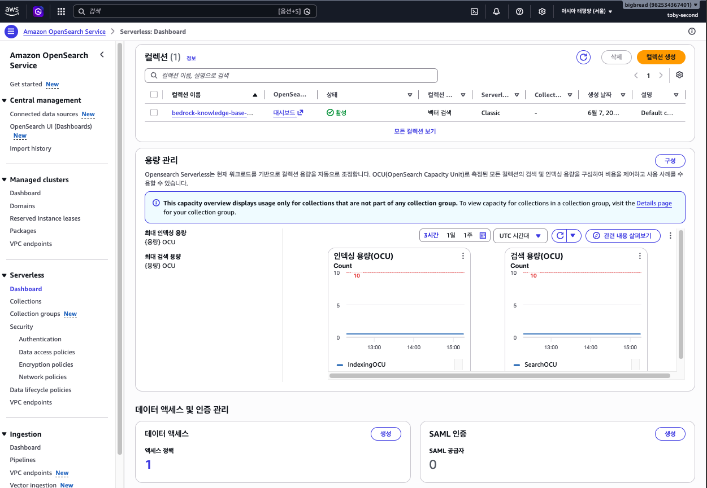

# Module 3 — RAG 챗봇 테스트 & 리소스 정리

> **소요 시간**: 약 15분
>
> **목표**: Knowledge Base 테스트 패널에서 RAG 챗봇을 테스트한 뒤, 과금 방지를 위해 핸즈온에서 만든 모든 AWS 리소스를 삭제합니다.

## 3-1. Knowledge Base 테스트 패널 사용

동기화가 완료되면 Knowledge Base 상세 페이지의 내장 테스트 패널에서 바로 RAG 챗봇을 테스트할 수 있습니다.


1. **Amazon Bedrock** 콘솔 → **Knowledge Bases** → `scd26-crosscloud-rag-kb` 클릭
2. 우측의 **Test knowledge base** 패널에서:

| 항목 | 설정 |
|------|------|
| Select model | **Anthropic Claude 3.5 Sonnet** (또는 Claude 3 Haiku) |
| Source details | **ON** (출처 문서 표시) |


## 3-2. 테스트 질문으로 RAG 응답 확인

아래 질문들을 순서대로 입력하고, 응답이 **S3에 업로드한 문서 내용을 기반으로** 답변하는지 확인합니다.

### 질문 1: 기본 검색

```
Amazon S3란 무엇인가요?
```

**확인 포인트**:
- 응답이 업로드한 문서의 S3 관련 내용을 참조하는지
- 하단의 **Source** 섹션에 참조 문서와 청크가 표시되는지

### 질문 2: 구체적 정보 검색

```
Amazon Bedrock에서 지원하는 Foundation Model에는 어떤 것들이 있나요?
```

**확인 포인트**:
- 문서에 있는 구체적인 모델 목록을 답변하는지
- 일반 LLM 학습 데이터가 아닌, **업로드한 문서 기반** 답변인지

### 질문 3: 문서에 없는 내용

```
오늘 서울의 날씨는 어떤가요?
```

**확인 포인트**:
- "관련 정보를 찾을 수 없습니다" 또는 유사한 응답이 나오는지
- RAG가 잘 동작한다면, 문서에 없는 내용에 대해 환각(hallucination) 없이 답변을 거절해야 합니다

<!--  -->

> 응답 하단의 **Show source details**를 열면 참조한 S3 문서 경로, 실제 검색된 청크, 관련도 점수를 확인할 수 있습니다.
> 이를 통해 RAG 파이프라인이 어떤 문서의 어느 부분을 참조해 답변했는지 추적할 수 있습니다.

## 3-3. 핸즈온 정리

축하합니다! Cross-Cloud RAG 챗봇 구축을 완료했습니다.

### 오늘 핸즈온에서 다룬 전체 흐름

```
Google Cloud Storage (GCS)
    │   원본 문서 저장
    ▼
AWS DataSync (HMAC Key 인증)
    │   크로스 클라우드 데이터 전송
    ▼
Amazon S3
    │   문서 저장 (AWS 측)
    ▼
Amazon Bedrock Knowledge Bases
    │   파싱 → 청킹 → 임베딩 → 벡터 인덱싱 (자동)
    │   OpenSearch Serverless (벡터 DB, 자동 생성)
    ▼
KB 테스트 패널 (Claude 3.5 Sonnet)
    │   질의 → 검색 → 답변 생성 (RAG)
    ▼
사용자에게 답변 제공
```

### 핵심 학습 포인트

1. **크로스 클라우드 데이터 이동**: AWS DataSync + HMAC 키로 GCS↔S3 간 데이터 동기화
2. **매니지드 RAG 파이프라인**: Bedrock Knowledge Bases가 임베딩~검색~생성을 자동 처리
3. **RAG의 효과**: 문서 기반 답변으로 환각 감소, 출처 추적 가능

---

## 리소스 정리 (과금 방지)

!!! danger "즉시 진행 필수"
    OpenSearch Serverless는 **시간당 $0.48** (2 OCU)이 과금됩니다.
    핸즈온이 끝나면 **곧바로** 아래 정리를 진행하세요.

리소스끼리 의존 관계가 있어서 **아래 순서대로** 삭제해야 합니다.

1. **Bedrock Knowledge Base** 를 가장 먼저 삭제합니다. Quick create로 만들어진 OpenSearch 컬렉션이 함께 지워집니다.
2. **DataSync 태스크와 위치** 를 삭제합니다. 전송에 사용한 리소스입니다.
3. **S3 버킷** 을 마지막으로 삭제합니다. 객체를 먼저 비운 뒤 버킷을 지웁니다.

> 아래 각 단계의 **제품 이름(예: Amazon Bedrock, AWS DataSync, S3)을 클릭하면** 오레곤 리전(`us-west-2`) 콘솔의 해당 제품 위치로 바로 이동합니다.

## 3-4. Bedrock Knowledge Base 삭제

1. [**Amazon Bedrock** 콘솔](https://us-west-2.console.aws.amazon.com/bedrock/home?region=us-west-2#/knowledge-bases) → **Knowledge Bases**
2. `scd26-crosscloud-rag-kb` 선택
3. **Delete** 클릭
4. 확인 다이얼로그에서 Knowledge Base 이름을 입력하고 **Delete** 확인

<!--  -->

> Knowledge Base를 삭제하면 **Quick create로 자동 생성된 OpenSearch Serverless 컬렉션도 함께 삭제**됩니다.
> 이것이 과금의 주요 원인이므로 가장 먼저 삭제합니다.

### 확인: OpenSearch Serverless 컬렉션 삭제 확인

1. [**Amazon OpenSearch Service** 콘솔](https://us-west-2.console.aws.amazon.com/aos/home?region=us-west-2#opensearch/collections)로 이동
2. 좌측 메뉴에서 **Serverless** → **DashBoard or Collections**
3. Bedrock KB가 생성한 컬렉션이 **삭제 중** 또는 이미 사라졌는지 확인



> 만약 컬렉션이 남아있다면 수동으로 삭제합니다:
> 컬렉션 선택 → **Delete** → 확인

## 3-5. DataSync 태스크 & 위치 삭제

### 태스크 삭제

1. [**AWS DataSync** 콘솔](https://us-west-2.console.aws.amazon.com/datasync/home?region=us-west-2#/tasks) → **Tasks**
2. `scd26-gcs-to-s3-transfer` 태스크 선택
3. **Actions** → **Delete** 클릭
4. 확인 후 삭제

<!--  -->

### 위치 삭제

1. [**AWS DataSync** 콘솔](https://us-west-2.console.aws.amazon.com/datasync/home?region=us-west-2#/locations) → **Locations**
2. 생성한 위치 2개를 각각 선택하여 삭제:
   - Object storage 위치 (GCS 소스)
   - Amazon S3 위치 (대상)
3. 각각 **Actions** → **Delete** 클릭

## 3-6. S3 버킷 삭제

S3 버킷은 **비어있어야만** 삭제할 수 있습니다.

### 버킷 비우기

1. [**S3** 콘솔](https://us-west-2.console.aws.amazon.com/s3/buckets?region=us-west-2) → `scd26-handson-rag-docs-{이니셜}` 버킷 클릭
2. 모든 객체를 선택 (체크박스) → **Delete** 클릭
3. `permanently delete` 입력 → **Delete objects** 확인

### 버킷 삭제

1. S3 콘솔의 버킷 목록으로 돌아갑니다
2. 버킷 이름 좌측 라디오 버튼 선택 → **Delete** 클릭
3. 버킷 이름을 입력 → **Delete bucket** 확인

<!--  -->

## 3-7. IAM 역할 삭제 (선택)

Bedrock KB와 DataSync가 자동 생성한 IAM 역할을 정리합니다.

1. [**IAM** 콘솔](https://console.aws.amazon.com/iam/home#/roles) → **Roles**
2. 아래 패턴의 역할을 검색하여 삭제:
   - `AmazonBedrockExecutionRoleForKnowledgeBase_*`
   - `AWSDataSyncS3BucketAccess-*`
3. 해당 역할 선택 → **Delete** → 역할 이름 입력 → 삭제 확인

> 이 단계는 선택 사항이지만, 계정을 깔끔하게 유지하고 싶다면 진행하세요.

## 삭제 완료 체크리스트

모든 리소스가 잘 지워졌는지 아래 항목으로 점검하세요.

- [ ] **Bedrock Knowledge Base** 삭제됨
- [ ] **OpenSearch Serverless** 컬렉션 삭제됨 (자동 삭제 확인)
- [ ] **DataSync 태스크** 삭제됨
- [ ] **DataSync 위치** 2개 삭제됨
- [ ] **S3 버킷** 비우기 + 삭제됨
- [ ] (선택) **IAM 역할** 삭제됨

## 비용 확인

삭제 후 예상 비용을 확인해봅니다.

1. AWS 콘솔 우측 상단 **계정 이름** 클릭 → [**Billing and Cost Management**](https://console.aws.amazon.com/billing/home)
2. 핸즈온 당일 발생한 비용이 ~$1.50 이하인지 확인

> 다음 날 **Cost Explorer**에서 서비스별 상세 비용을 확인할 수 있습니다.

??? example "CLI 스크립트로 자동 삭제 (복사/붙여넣기용)"

    콘솔에서 하나씩 지우는 대신 AWS CLI로 모든 리소스를 한 번에 삭제할 수 있습니다.
    아래 스크립트를 터미널에 복사하여 실행하세요.

    !!! danger "되돌릴 수 없습니다"
        이 스크립트는 핸즈온에서 생성한 **모든 리소스를 영구 삭제**합니다.
        실행 전 S3 버킷 이름을 정확히 확인하세요.

    **실행 방법**:
    ```bash
    chmod +x scripts/cleanup-aws.sh
    ./scripts/cleanup-aws.sh
    ```

    **전체 스크립트**:
    ```bash
    #!/bin/bash
    set -euo pipefail

    REGION="${REGION:-${AWS_REGION:-${AWS_DEFAULT_REGION:-us-west-2}}}"

    echo "============================================"
    echo "  SCD-26 Cross-Cloud RAG 핸즈온 리소스 정리"
    echo "============================================"
    echo ""
    echo "⚠ 이 스크립트는 핸즈온에서 생성한 모든 AWS 리소스를 삭제합니다."
    read -rp "계속하시겠습니까? (y/n): " CONFIRM
    if [[ "$CONFIRM" != "y" && "$CONFIRM" != "Y" ]]; then
      echo "취소되었습니다."
      exit 0
    fi

    read -rp "S3 버킷 이름: " S3_BUCKET

    # ─── Step 1: Bedrock Knowledge Base 삭제 ──────────────────────
    echo ""
    echo "━━━ [1/4] Bedrock Knowledge Base 삭제 ━━━"
    KB_ID=$(aws bedrock-agent list-knowledge-bases \
      --region "$REGION" \
      --query 'knowledgeBaseSummaries[?name==`scd26-crosscloud-rag-kb`].knowledgeBaseId' \
      --output text 2>/dev/null)

    if [[ -n "$KB_ID" && "$KB_ID" != "None" ]]; then
      DS_IDS=$(aws bedrock-agent list-data-sources \
        --knowledge-base-id "$KB_ID" \
        --region "$REGION" \
        --query 'dataSourceSummaries[].dataSourceId' \
        --output text 2>/dev/null)

      for DS_ID in $DS_IDS; do
        echo "  데이터 소스 삭제: $DS_ID"
        aws bedrock-agent delete-data-source \
          --knowledge-base-id "$KB_ID" \
          --data-source-id "$DS_ID" \
          --region "$REGION" \
          --output text > /dev/null 2>&1 || true
      done

      echo "  Knowledge Base 삭제: $KB_ID"
      aws bedrock-agent delete-knowledge-base \
        --knowledge-base-id "$KB_ID" \
        --region "$REGION" \
        --output text > /dev/null 2>&1
      echo "✓ Knowledge Base 삭제 완료 (OpenSearch Serverless도 자동 삭제됨)"
    else
      echo "  Knowledge Base를 찾을 수 없습니다. 건너뜁니다."
    fi

    # ─── Step 2: DataSync 태스크 & 위치 삭제 ──────────────────────
    echo ""
    echo "━━━ [2/4] DataSync 태스크 & 위치 삭제 ━━━"
    TASK_ARNS=$(aws datasync list-tasks \
      --region "$REGION" \
      --query 'Tasks[?Name==`scd26-gcs-to-s3-transfer`].TaskArn' \
      --output text 2>/dev/null)

    for TASK_ARN in $TASK_ARNS; do
      echo "  태스크 삭제: $TASK_ARN"
      aws datasync delete-task \
        --task-arn "$TASK_ARN" \
        --region "$REGION" \
        --output text > /dev/null 2>&1 || true
    done

    LOCATION_ARNS=$(aws datasync list-locations \
      --region "$REGION" \
      --query 'Locations[].LocationArn' \
      --output text 2>/dev/null)

    for LOC_ARN in $LOCATION_ARNS; do
      LOC_URI=$(aws datasync describe-location-object-storage \
        --location-arn "$LOC_ARN" \
        --region "$REGION" \
        --query 'LocationUri' --output text 2>/dev/null || \
        aws datasync describe-location-s3 \
        --location-arn "$LOC_ARN" \
        --region "$REGION" \
        --query 'LocationUri' --output text 2>/dev/null || echo "")

      if [[ "$LOC_URI" == *"storage.googleapis.com"* ]] || [[ "$LOC_URI" == *"$S3_BUCKET"* ]]; then
        echo "  위치 삭제: $LOC_URI"
        aws datasync delete-location \
          --location-arn "$LOC_ARN" \
          --region "$REGION" \
          --output text > /dev/null 2>&1 || true
      fi
    done
    echo "✓ DataSync 리소스 삭제 완료"

    # ─── Step 3: S3 버킷 삭제 ─────────────────────────────────────
    echo ""
    echo "━━━ [3/4] S3 버킷 삭제 ━━━"
    if aws s3api head-bucket --bucket "$S3_BUCKET" --region "$REGION" 2>/dev/null; then
      echo "  버킷 비우는 중..."
      aws s3 rm "s3://$S3_BUCKET" --recursive --region "$REGION" > /dev/null 2>&1
      echo "  버킷 삭제 중..."
      aws s3api delete-bucket --bucket "$S3_BUCKET" --region "$REGION"
      echo "✓ S3 버킷 삭제 완료: $S3_BUCKET"
    else
      echo "  S3 버킷을 찾을 수 없습니다. 건너뜁니다."
    fi

    # ─── Step 4: IAM 역할 삭제 ────────────────────────────────────
    echo ""
    echo "━━━ [4/4] IAM 역할 삭제 ━━━"
    for ROLE_NAME in "DataSyncS3Role-scd26-handson" "AmazonBedrockKBRole-scd26-handson"; do
      if aws iam get-role --role-name "$ROLE_NAME" > /dev/null 2>&1; then
        POLICIES=$(aws iam list-role-policies \
          --role-name "$ROLE_NAME" \
          --query 'PolicyNames' --output text 2>/dev/null)
        for POLICY in $POLICIES; do
          aws iam delete-role-policy --role-name "$ROLE_NAME" --policy-name "$POLICY"
        done
        aws iam delete-role --role-name "$ROLE_NAME"
        echo "✓ IAM 역할 삭제: $ROLE_NAME"
      fi
    done

    echo ""
    echo "============================================"
    echo "  리소스 정리 완료!"
    echo "============================================"
    echo ""
    echo "  ▶ AWS 콘솔에서 OpenSearch Serverless 컬렉션이"
    echo "    삭제되었는지 최종 확인하세요."
    ```

    > 스크립트는 콘솔 경로(`AmazonBedrockExecutionRoleForKnowledgeBase_*`, `AWSDataSyncS3BucketAccess-*`)가 아닌 **CLI 스크립트로 만든 역할**(`DataSyncS3Role-scd26-handson`, `AmazonBedrockKBRole-scd26-handson`)을 삭제합니다.
    > 콘솔로 핸즈온을 진행했다면 IAM 역할은 위 **3-7** 단계대로 콘솔에서 삭제하세요.

---

**수고하셨습니다!** Cross-Cloud RAG 챗봇 핸즈온을 완료했습니다.

**이전**: [Module 2: Bedrock Knowledge Bases](02-bedrock-kb-create.md) | **처음으로**: [Home](index.md)
