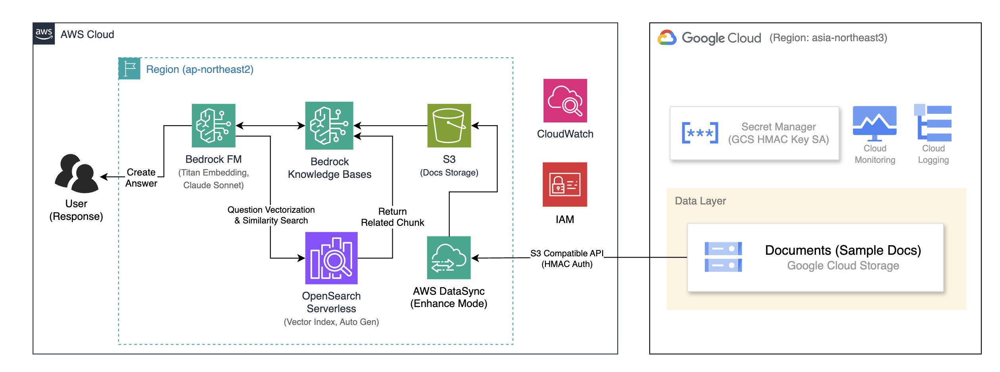
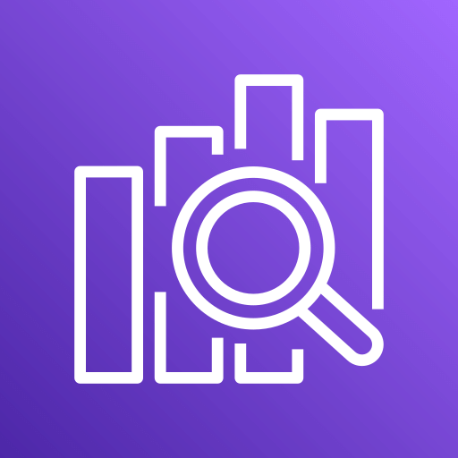

---
hide:
  - navigation
  - toc
---

  <h1 class="asb-course-title">Amazon Bedrock으로 만드는 Cross-Cloud RAG 챗봇 (한국어)</h1>
  

    핸즈온 워크숍
    |
    ★
    4.5 (50)
    |
    40분
    |
    한국어
  

  

    
  

  

    <h2 class="asb-resume-heading">다시 시작</h2>
    
Module 0 - 사전 준비

    <a href="00-prerequisites/" class="asb-btn asb-btn-primary" id="asb-resume-link">이어서 하기</a>
  

  <button class="asb-tab" role="tab" data-tab="details" aria-selected="false">세부 정보</button>
  <button class="asb-tab asb-tab-active" role="tab" data-tab="overview" aria-selected="true">개요</button>

  

    <aside class="asb-timeline" id="asb-timeline" aria-label="모듈 진행 현황">
      <!-- populated by progress.js -->
    </aside>
    

      <!-- populated by progress.js -->
    

  

<h2 class="asb-section-title">아키텍처</h2>

  

  <strong>워크숍 소개</strong>  
  이 핸즈온은 AWS 매니지드 서비스를 활용하여 <strong>멀티클라우드 RAG(Retrieval-Augmented Generation) 파이프라인</strong>을 구축해보는 입문~초급 난이도의 실습입니다.  
  Google Cloud Storage(GCS)에 저장된 RAG용 문서를 <strong>AWS DataSync</strong>의 HMAC 키 인증으로 Amazon S3에 전송한 뒤,
  <strong>Amazon Bedrock Knowledge Bases</strong>를 통해 문서 파싱 → 청킹 → Titan Embeddings V2 임베딩 → OpenSearch Serverless 벡터 인덱싱까지
  전 과정을 <strong>별도의 코딩 없이 AWS 콘솔 클릭만으로</strong> 완료합니다.  
  최종적으로 <strong>Anthropic Claude 3.5 Sonnet</strong> 모델과 연동된 KB 테스트 패널에서 RAG 챗봇을 직접 체험해봅니다.  
  <strong>학습 목표</strong>
  <ul style="margin:0.5rem 0 0; padding-left:1.2rem;">
    <li>AWS DataSync + HMAC 키를 이용한 <strong>크로스 클라우드 데이터 이동</strong> 패턴 이해</li>
    <li>Bedrock Knowledge Bases의 <strong>매니지드 RAG 파이프라인</strong> (파싱 → 청킹 → 임베딩 → 인덱싱) 구축</li>
  </ul>

<h2 class="asb-section-title">실습 흐름</h2>

<table>
  <thead>
    <tr><th>단계</th><th>클라우드</th><th>설명</th></tr>
  </thead>
  <tbody>
    <tr><td><strong>1. 데이터 소스</strong></td><td>Google Cloud (GCS)</td><td>진행자가 미리 준비한 RAG용 샘플 문서</td></tr>
    <tr><td><strong>2. 데이터 전송</strong></td><td>AWS DataSync</td><td>GCS → S3 크로스 클라우드 동기화 (HMAC 키 인증)</td></tr>
    <tr><td><strong>3. RAG 파이프라인</strong></td><td>AWS (Bedrock KB)</td><td>문서 파싱 → 청킹 → 임베딩 → 벡터 인덱싱 (자동)</td></tr>
    <tr><td><strong>4. 챗봇 테스트</strong></td><td>AWS (Bedrock)</td><td>KB 테스트 패널에서 Claude 3.5 Sonnet으로 RAG 질의응답</td></tr>
  </tbody>
</table>

<h2 class="asb-section-title">사용 AWS 서비스</h2>

<table>
  <thead>
    <tr><th>서비스</th><th>용도</th></tr>
  </thead>
  <tbody>
    <tr><td><strong>Amazon S3</strong></td><td>DataSync로 전송받은 문서 저장</td></tr>
    <tr><td><strong>AWS DataSync</strong></td><td>GCS → S3 크로스 클라우드 데이터 전송</td></tr>
    <tr><td><strong>Amazon Bedrock Knowledge Bases</strong></td><td>RAG 파이프라인 (파싱 → 청킹 → 임베딩 → 인덱싱)</td></tr>
    <tr><td><strong>Amazon Titan Text Embeddings V2</strong></td><td>문서를 벡터로 변환하는 임베딩 모델</td></tr>
    <tr><td><strong>Amazon OpenSearch Serverless</strong></td><td>벡터 인덱스 저장 및 검색 (자동 생성)</td></tr>
    <tr><td><strong>Anthropic Claude 3.5 Sonnet</strong></td><td>RAG 챗봇 응답 생성 모델</td></tr>
  </tbody>
</table>

  <strong>비용 안내</strong> 
  이 워크숍은 AWS에서 제공하는 핸즈온 계정을 사용합니다.
  <strong>개인 계정</strong>으로 진행하는 경우 소량의 비용이 발생할 수 있으며, 실습이 끝나면 반드시 Module 4 — 리소스 정리를 진행하세요.

